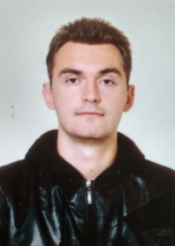

---

# **George Kartavenko**


---

## Phone Number

### _+375 (29) 726-54-47_

---

## Email

### *SocialImp@mail.ru*

---

## Discord

### _@George-RB_

---

## My Goals

### _I want to become a skilled developer at EPAM, focusing on continuous learning and contribution to cutting-edge projects. My goal is to leverage my programming knowledge and grow professionally in a dynamic environment._

---

## Skills

### _Programming Languages: JavaScript, CSS, HTML, SASS_

### _Version Control: Git_

### _Development Tools: VSCode, GitHub_

---

## Examples of Code

```javascript
function multiply(a, b) {
  return a * b;
}
```

---

## Work Experience

### _Currently, I do not have professional work experience. However, I have completed several academic projects and am eager to apply my knowledge in a real-world setting._

---

## Education
### *Mozyr State Pedagogical University named after I.P. Shamyakin*
  - **Specialization:** Applied Mathematics
  - **Years:** 2011 - 2016

---

## Additional Information
### *I am highly motivated and dedicated to continuously improving my skills. I enjoy solving complex problems and am always looking for new challenges. In my free time, I like to contribute to open-source projects and stay updated with the latest trends in web development.*

---

---

## English

### _My level of English is A2, and I am actively working on improving my proficiency through courses and self-study._

---

## Projects

### **CV Project**

- **Description:** Developed this CV to showcase my skills and knowledge.
- **Technologies:** Markdown, HTML, CSS
- **GitHub Link:** [CV Project](https://github.com/George-RB/rsschool-cv/blob/gh-pages/CV.md)

---

## Additional Information

### _I am highly motivated and dedicated to continuously improving my skills. I enjoy solving complex problems and am always looking for new challenges. In my free time, I like to contribute to open-source projects and stay updated with the latest trends in web development._

---
